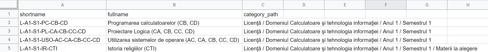

# Contributing

It is recommended that you go through [our workshop](https://github.com/acs-upb-mobile/flutter-workshop) first, to familiarize yourself with the technologies and the contribution process.

## Table of Contents
* [Pull Request (contribution) process](#pull-request--contribution--process)
  + [Guidelines](#guidelines)
  + [Branches](#branches)
  + [Merging](#merging)
* [Development tips](#development-tips)
* [Style guide](#style-guide)
* [GitHub Actions](#github-actions)
* [Working with Firebase](#working-with-firebase)
  + [Setup](#setup)
  + [Authentication](#authentication)
  + [Firestore](#firestore)
    - [Data model](#data-model)
    - [Security rules](#security-rules)
    - [Indexes](#indexes)
    - [Project database](#project-database)
  + [Storage](#storage)
    - [Structure](#structure)
    - [Security rules](#security-rules-1)
  + [Functions](#functions)
* [Internationalization](#internationalization)
  + [On-device](#on-device)
  + [Remote](#remote)
  + [Changing the locale](#changing-the-locale)
  + [Fetching the locale](#fetching-the-locale)
* [Custom icons](#custom-icons)
  + [Generating the font file](#generating-the-font-file)
  + [Updating the project](#updating-the-project)

## Pull Request (contribution) process
### Guidelines
1. Check out [this](https://opensource.com/article/19/7/create-pull-request-github) tutorial if you don't know how to make a PR.
2. Increase the version number in the [`pubspec.yaml`](pubspec.yaml) file with the following guidelines in mind:
    - **Build number** (0.2.1+**4**) is for very small changes and bug fixes (usually not visible to the end user). It should *always be incremented*, never reset, as it is what Google Play uses to tell updates apart.
    - **Patch version** (0.2.**1**+4) is for minor improvements that may be visible to an attentive end user. It should reset to 0 when the minor/major version increments.
    - **Minor version** (0.**2**.1+4) is for added functionality (i.e. merging a branch that introduces a new feature). It should reset to 0 when the major version increments.
    - **Major version** (**0**.2.1+4) marks important project milestones.
3. Document any non-obvious parts of the code and make sure the commit description is clear on why the change is necessary.
4. If it's a new feature, write at least one test for it.

Please note that in order for a PR to be merged (accepted), all of the tests need to pass, including the linter (which checks for coding style and warnings, see [Style guide](#style-guide)). These checks are ran automatically using [GitHub Actions](#github-actions). You also need at least one approval from a maintainer - after submitting a PR, you can request a review from the top right Reviewers menu on the Pull Request page.

### Branches
Please use the following structure for creating new development branches:
```
[username]/[snake_case_branch_name]
```
This will make branches easier to find and search for.<br>
Examples:
```
razvanra2/add_authoring_policy
luigi/dev_eng_improv
auditore/fix_md_typo
torvalds/android_speedups
```
### Merging
When developing a new feature or working on a bug, your pull request will end up containing fix-up commits (commits that change the same line of code repeatedly) or too fine-grained commits. An issue that can arise from this is that the main branch history will become polluted with unnecessary commits. To avoid it, we implement and enforce a squash policy.
All commits that are merged into the main development branch have to be squashed ahead of the merge.
You can do so by pressing "squash and merge" in GitHub (_recommended_), or, alternatively, following the generic local squash routine outlined bellow:
```bash
git checkout your_branch_name
git rebase -i HEAD~n
# n is normally the number of commits in the pull request.
# Set commits (except the one in the first line) from 'pick' to 'squash', save and quit.
# On the next screen, edit/refine commit messages.
# Save and quit.
git push -f # (force push to GitHub)
```
Please update the resulting commit message, if needed. It should read as a coherent message. In most cases, this means not just listing the interim commits.

Please refrain from creating several pull requests for the same change. Use the pull request that is already open (or was created earlier) to amend changes. This preserves the discussion and review that happened earlier for the respective change set.
Similarly, please create one PR per development item, instead of bundling multiple fixes and improvements in a single PR.

| :warning: | After the merging is concluded, please delete the branches related to the pull request that you just closed.|
|-----------|:------------------------------------------------------------------------------------------------------------|


## Development tips

* Make sure you have the *Project* view open in the **Project** tab on the left in Android Studio (not *Android*).
* Flutter comes with **Hot Reload** (the lightning icon, or *Ctrl+\\* or *⌘\\*), which allows you to load changes in the code quickly into an already running app, without you needing to reinstall it. It's a very handy feature, but it doesn't work all the time - if you change the code, use Hot Reload but don't see the expected changes, or see some weird behaviour, you may need to close and restart the app (or even reinstall).
* If **running on web** doesn't give the expected results after changing some code, you may need to clear the cache (in *Chrome*: *Ctrl+Shift+C* or *⌘+Shift+C* to open the Inspect menu, then right-click the *Refresh* button, and select *Empty cache and Hard reload*.)
* [Flutter Inspector](https://flutter.dev/docs/development/tools/devtools/inspector) is a powerful tool which allows you to visualize and explore Flutter widget trees. You can use it to find out where a specific part of the UI is defined in the code (by turning on *Select widget mode* and selecting the widget you'd like to find), it can help you debug layouts (by enabling *Debug Paint*, you can visualize padding, alignments and widget borders) and much more.
  - If *Flutter Inspector* doesn't work when running on web, a possible solution is to disable *embedding DevTools* (IntelliJ/Android Studio: `File > Settings > Languages & Frameworks > Flutter > Enable embedding DevTools in the Flutter Inspector tool window`).
* Get used to **reading code and searching through the codebase**. The project is fairly large and for most things, you should be able to find a usage/implementation example within our codebase. Do try to reuse code as much as possible - prefer creating a customizable widget with the parameters you need for different use cases, over copy-pasting widget code. Some tips for exploring the codebase:
  - *Ctrl+Shift+F* or *⌘+Shift+F* upon clicking a directory in the Project view lets you search a keyword through the entire directory. This is particularly useful for searching for something in the entire codebase.
  - *Ctrl+click* or *⌘+click* through a class/method name takes you to its definition. You can also right-click on it and use "Find usages" or the various "Go To" options to explore how it is used/defined.
    * Oftentimes, a class definition will be in a file that is outside our project - either from a package or the Flutter framework itself. These files are marked with a yellow background in the Android Studio tab bar. You cannot edit them, but it's often useful to read through them to understand how they work.


* By default, **Flutter apps run in debug mode**. That means a DEBUG banner is shown on the upper right corner of the app, and errors and overflows are marked quite visibly in the UI.
  - If you'd like to temporarily hide the debug mode banner (to take a screenshot, for instance), open the *Flutter Inspector* tab from the right hand edge of Android Studio, click *More actions* and select *Hide debug mode banner*.
  - Note that Flutter's debug mode is different from the Android Studio debugging (bug button), which is meant to allow you to use breakpoints and other debugging tools.
  - If you really need to test the release version (usually not necessary), run `flutter run --release` from the Terminal.
    * The release version cannot be ran in an emulator.
    * You may also need to temporarily change the release signing config. In the [android/app/build.gradle](android/app/build.gradle) file, replace `signingConfig signingConfigs.release` with `signingConfig signingConfigs.debug`.
    * To switch to debug config on web, in the [web/index.html](web/index.html) file, replace `firebaseConfig.release` with `firebaseConfig.debug`.
    * For simplicity, you could call the default "main.dart" configuration in Android Studio "Debug", duplicate it and call the second one "Release", with `--release` as an argument. For example:
    

- On Android, ACS UPB Mobile uses **a separate (development) environment in debug mode**. That means a completely different Firebase project - separate data, including user info. This is not used automatically on iOS and web (#105), but on web you can manually switch to the dev environment by replacing `firebaseConfig.release` with `firebaseConfig.debug` in the [web/index.html](web/index.html) file.

  | :exclamation: | You should ALWAYS use the separate development environment for testing the app when modifying any kind of data, so as not to risk breaking something in the production database. |
  |---------------|:---------------|

## Style guide

This project uses [the official Dart style guide](https://dart.dev/guides/language/effective-dart/style)  with the following mentions:

* Android Studio (IntelliJ) with the `dartfmt` tool is used to automatically format the code (*Ctrl+Alt+L* or *⌥+⌘+L*), including the order of imports (*Ctrl+Alt+O* or *⌥+⌘+O*).
* The [extra_pedantic](https://pub.dev/packages/extra_pedantic) package is used for static analysis: it automatically highlights warnings related to the [recommended dart style](https://dart.dev/guides/language/effective-dart/style). Most of them can be fixed automatically by invoking Context Actions (place the cursor on the warning and press *Alt+Enter*) and selecting the correct action. **Do not suppress a warning** unless you know what you're doing - if you don't know how to fix it and Android Studio doesn't help, hover over the warning and you'll see a link to the documentation that can help you understand.
* Where necessary, comments should use Markdown formatting (e.g. ``` `backticks` ``` for code snippets and `[brackets]` for code references).

## GitHub Actions

This project uses [GitHub Actions](https://github.com/features/actions) for CI/CD. That means that testing and deployment are automated.

The following actions are currently set up:
* [Linter](https://github.com/acs-upb-mobile/acs-upb-mobile/actions?query=workflow%3ALinter): Checks for typos, warnings and coding style issues based on the [Dangerfile](.github/linter/Dangerfile). Runs on every push and pull request.
  - If your PR is made from a branch inside the repository (rather than a fork), which is the preferred way to make contributions, [acs-upb-mobile-bot](https://github.com/acs-upb-mobile-bot) should automatically *add code review comments pointing out any warnings*.
    * Sometimes, the automatic check for dead links in documentation fails with "429 too many requests" (see [this issue](https://github.com/textlint-rule/textlint-rule-no-dead-link/issues/135)). You can ignore those if you know the links in question are good.
    * Do not ask the bot for review, it does it automatically.
  - If you have formatting issues, the "Check formatting" step will *point out the files that need to be formatted* and the workflow will fail.
* [Tests](https://github.com/acs-upb-mobile/acs-upb-mobile/actions?query=workflow%3ATests): Runs all tests in the [test/](test) directory and submits a coverage report to [codecov](https://codecov.io/gh/acs-upb-mobile/acs-upb-mobile). This action is triggered on every push and pull request.
  - If at least one test fails, this workflow will fail.
  - The *coverage* is the percentage of lines of code that are executed at least once in tests. This project aims to keep coverage above 70% at all times.
* [Deployment](https://github.com/acs-upb-mobile/acs-upb-mobile/actions?query=workflow%3ADeployment):
  Deploys the app to [Google Play](https://play.google.com/store/apps/details?id=ro.pub.acs.acs_upb_mobile), as well as the website ([acs-upb-mobile.web.app](https://acs-upb-mobile.web.app/)), and creates a corresponding [GitHub Release](https://github.com/acs-upb-mobile/acs-upb-mobile/releases) including the APK. It also deploys Firebase functions as well as Firestore security rules and indexes (see [Working with Firebase](#working-with-firebase) for more info). This action is triggered when a new version tag (e.g. `v1.2.10`) is pushed.
  -  :exclamation: **Do not push version tags** unless you know what you are doing. If you do push a tag, you should annotate it (e.g. use a command like `git tag -a v1.2.10`) with the content of the en-US changelog file. The first line of the annotation should be the version (e.g. v1.2.10), followed by an empty line, followed by the content of the English changelog.
  - For the Google Play release, we are using [fastlane](https://fastlane.tools/). It requires creating changelog files in each supported language under [android/fastlane/metadata/android](android/fastlane/metadata/android), with the name `$(pubspec_build_number + 10000).txt`. For example, if the version in [pubspec.yaml](pubspec.yaml) is `1.2.10+12`, the files should be named `100012.txt`. The content of the changelog file is what the users will se under the "What's new" section in Google Play, and should use a friendly language and generally be organised by sections like `Added`, `Fixed`, `Improved` etc. Look at the existing changelogs for examples.

## Working with Firebase
ACS UPB Mobile uses [Firebase](https://firebase.google.com/) - an app development platform built on Google infrastructure and using [Google Cloud Platform](https://cloud.google.com/) - to manage remote storage and authentication, as well as other cloud resources. We have two separate projects for the app - one for production (acs-upb-mobile) and one for development (acs-upb-mobile-dev). The former is the "real" app with actual user data, and we use the latter when developing and adding new features to avoid causing disturbances in the production environment that users could notice. You can ask a maintainer to gain access to the development project, and in most cases you shouldn't need access to the production project.

### Setup
This application uses [flutterfire](https://github.com/FirebaseExtended/flutterfire) plugins in order to access Firebase services. They are already enabled in the [pubspec](pubspec.yaml) file and ready to import and use in the code.

:exclamation: FlutterFire only has [Cloud Storage](#storage) support for Android and iOS. The web version needs a special implementation. See [resources/storage](lib/resources/storage) for an example.

Firebase projects can be managed through the [Firebase console](https://console.firebase.google.com/) and the [Firebase CLI](https://firebase.google.com/docs/cli). To set up the CLI tools, follow [the official instructions](https://firebase.google.com/docs/cli#install_the_firebase_cli). You should then authenticate using `firebase login`. You **DO NOT** need to run `firebase init`, as the project is already initialized in the repo.

### Authentication

Firebase provides an entire suite of back-end services and SDKs for authenticating users within an application, through [FirebaseAuth](https://firebase.google.com/docs/auth).

For our application, we use the following features:
* account creation
* login
* password reset via e-mail
* account verification via e-mail
* account deletion

Firebase Authentication stores [user information](https://firebase.google.com/docs/cli/auth#file_format) such as *UID*, *email*, *name* and *password hash*. In order to store additional information such as *user preferences* and *group*, when a new user signs up, a corresponding document is created in the [users](#users-collection) collection.

This service automatically *handles the authentication tokens* and *enforces security rules*, which is particularly useful for an open-source application which users can fiddle with, such as ours. For example, multiple failed authentication attempts lead to a temporary timeout, and a user cannot delete their account unless they have logged in very recently (or refreshed their authentication token).

[Firestore security rules](#security-rules) can be enforced based on the user’s UID. This method means that, even though users can access the database connection string through the public repository, they can only do a limited set of actions on the database, depending on whether they are authenticated and their permissions.

### Firestore
[Cloud Firestore](https://firebase.google.com/docs/firestore) is a noSQL database that organises its data in *collections* and *documents*.

#### Data model
**Collections** are simply a list of documents, where each document has an ID within the collection.

**Documents** are similar to a JSON file (or a C `struct`, if you prefer), in that they contain different fields which have three important components: a ***name*** - what we use to refer to the field, similar to a dictionary key -, a ***type*** (which can be one of `string`, `number`, `boolean`, `map`, `array`, `null` - yeah *null* is its own type -, `timestamp`, `geopoint`, `reference` - sort of like a pointer to another document), and the actual ***value***, the data contained in the field.
In addition to fields, documents can contain collections… which contain other documents… which can contain collections, and so on and so forth, allowing us to create a hierarchical structure within the database.

More information about the Firestore data model can be found [here](https://firebase.google.com/docs/firestore/data-model).

#### Security rules

Firestore allows for defining specific security rules for each collection. Rules can be applied for each different type of transaction - `reads` (where single-document reads - `get` - and queries - `list` - can have different rules) and `writes` (where `create`, `delete` and `update` can be treated separately).

More information on Firestore security rules can be found [here](https://firebase.google.com/docs/firestore/security/rules-structure).

You can update security rules directly from the Firebase console (select Firestore Database from the side menu, then click the "Rules" tab). However, that can lead to conflicts when we deploy the rules from [firestore.rules](firestore.rules). Always remember to update the repo file as well, otherwise you risk your changes being overwritten. As of Aug 2021, there is no CLI command to fetch the current rules, so you have to manually copy them from the console to the file.

The preferred method to update security rules is through the [Firebase CLI](https://firebase.google.com/docs/cli) (see section [Setup](#setup) above). Simply edit the [firestore.rules](firestore.rules) file, then deploy the rules using the following commands:

```bash
firebase use dev # Make sure the dev environment is selected
firebase deploy --only firestore:rules
```

You do not need to worry about deploying to the production environment, as that is handled by the automated scripts that run when you merge a PR (see [GitHub Actions](#github-actions)).

#### Indexes

Indexes are useful to improve query performance, and Firestore requires an index for every query. Basic indexes are already generated, and when you run a query that requires a new index, you will get an error and a link that will walk you through creating the necessary indexes.

:exclamation: When you create a new index from the Firebase console, you must update the [firestore.indexes.json](firestore.indexes.json) file by calling:

```bash
firebase firestore:indexes > firestore.indexes.json
```

#### Project database
The project database contains the following collections:

<details>
<summary class="collection" id="users-collection"><b>users</b></summary>
This collection stores per-user data. The document key is the user's `uid` (from <a href=https://firebase.google.com/docs/auth>FirebaseAuth</a>).

###### Fields
All the documents in the collection share the same structure:

<table>
  <tr>
    <th>Field</th>
    <th>Type</th>
    <th>Required?</th>
    <th>Additional info</th>
  </tr>
  <tr>
    <td>group</td>
    <td><code>string</code></td>
    <td>🗹</td>
    <td>e.g. “314CB”</td>
  </tr>
  <tr>
    <td>name</td>
    <td><code>map&lt;string, string&gt;</code></td>
    <td>🗹</td>
    <td>keys are “first” and “last”</td>
  </tr>
  <tr>
    <td>permissionLevel</td>
    <td><code>number</code></td>
    <td>☐</td>
    <td>a numeric value that defines what the user is allowed to do; if missing, it is treated as being equal to zero</td>
  </tr>
</table>

###### Sub-collections
* **websites**  
A user can define their own websites, that only they have access to. These will reside in the __websites__ sub-collection, and have the following field structure, similar to the one in the root-level <a href=#websites-collection>websites</a> collection:
<table>
  <tr>
    <th>Field</th>
    <th>Type</th>
    <th>Required?</th>
    <th>Additional info</th>
  </tr>
  <tr>
    <td>category</td>
    <td><code>string</code></td>
    <td>🗹</td>
    <td>one of: “learning”, “association”, “administrative”, “resource”, “other”</td>
  </tr>
  <tr>
    <td>icon</td>
    <td><code>string</code></td>
    <td>☐</td>
    <td>path in Firebase Storage; if missing, it defaults to "icons/websites/globe.png"</td>
  </tr>
  <tr>
    <td>label</td>
    <td><code>string</code></td>
    <td>🗹</td>
    <td>unless specified, the app sets this to be the link without the protocol</td>
  </tr>
  <tr>
    <td>link</td>
    <td><code>string</code></td>
    <td>🗹</td>
    <td>it needs to include the protocol</td>
  </tr>
</table>

###### Rules

Anyone can **create** a new user (a new document in this collection) _if the `permissionLevel` of the created user is 0, null or not set at all_.

Authenticated users can only **read**, **delete** and **update** their own document (including its sub-collections) and no one else's. However, they cannot modify the `permissionLevel` field.

</details>

<details>
<summary class="collection" id="websites-collection"><b>websites</b></summary>
This collection stores useful websites, shown in the app under the *Portal* page. Who they are relevant for depends on the `degree` and `relevance` fields (for more information, see the
<a href=#filters-collection>filters</a> collection).

###### Fields
All the documents in the collection share the same structure:
<table>
  <tr>
    <th>Field</th>
    <th>Type</th>
    <th>Required?</th>
    <th>Additional info</th>
  </tr>
  <tr>
    <td>addedBy</td>
    <td><code>string</code></td>
    <td>🗹</td>
    <td>ID of user who created this website</td>
  </tr>
  <tr>
    <td>category</td>
    <td><code>string</code></td>
    <td>🗹</td>
    <td>one of: “learning”, “association”, “administrative”, “resource”, “other”</td>
  </tr>
  <tr>
    <td>degree</td>
    <td><code>string</code></td>
    <td>⍰</td>
    <td>“BSc” or “MSc”, must be specified if relevance is not *null*</td>
  </tr>
  <tr>
    <td>editedBy</td>
    <td><code>array&lt;string&gt;</code></td>
    <td>☐</td>
    <td>list of user IDs</td>
  </tr>
  <tr>
    <td>icon</td>
    <td><code>string</code></td>
    <td>☐</td>
    <td>path in Firebase Storage; if missing, it defaults to "icons/websites/globe.png"</td>
  </tr>
  <tr>
    <td>label</td>
    <td><code>string</code></td>
    <td>🗹</td>
    <td>unless specified, the app sets this to be the link without the protocol</td>
  </tr>
  <tr>
    <td>link</td>
    <td><code>string</code></td>
    <td>🗹</td>
    <td>it needs to include the protocol</td>
  </tr>
  <tr>
    <td>relevance</td>
    <td><code>null / list&lt;string&gt;</code></td>
    <td>🗹</td>
    <td>*null* if relevant for everyone, otherwise a string of filter node names</td>
  </tr>
</table>

###### Rules

Since websites in this collection are public information (_anyone can **read**_), altering and adding data here is a privilege and needs to be monitored, therefore _anyone who wants to modify this data needs to be authenticated_ in the first place.

Users can **create** a new public website only _if their `permissionLevel` is equal to or greater than three and they sign the data by putting their `uid` in the `addedBy` field_.

Users can **update** a website _if they do not modify the `addedBy` field and they sign the modification by adding their `uid` at the end of the `editedBy` list_.

Users can only **delete** a website _if they are the ones who created it_ (their `uid` is equal to the `addedBy` field) _or if their `permissionLevel` is equal to or greater than four_.

</details>

<details>
<summary class="collection" id="filters-collection"><b>filters</b></summary>
This collection stores <a href=lib/pages/filter/model/filter.dart><code>Filter</code></a> objects.
These are basically trees with named nodes and levels. In the case of the relevance filter, they are meant to represent the way the University organises students:

```
                                  All
                    _______________|_______________
                  /                                \
                BSc                               MSc       // Degree
         ________|________                 ________|__ …
       /                  \              /     |
      IS                 CTI            IA   SPRC …       // Specialization
   …|…          ______|______       ⋮      ⋮
                  /    |     |   \
               CTI-1 CTI-2 CTI-3 CTI-4                      // Year
                  ⋮    ⋮   __|… ⋮
                        /   |
                     3-CA 3-CB …                          // Series
                     __|…
                   /   |
               331CA 332CA …                              // Group
```

###### Fields
All the documents in the collection share the same structure:

<table>
  <tr>
    <th>Field</th>
    <th>Type</th>
    <th>Required?</th>
    <th>Additional info</th>
  </tr>
  <tr>
    <td>levelNames</td>
    <td><code>array&lt;map&lt;string, string&gt;&gt;</code></td>
    <td>🗹</td>
    <td>localized names for each tree level (e.g. "Year"); the map keys are the locale strings ("en", "ro")</td>
  </tr>
  <tr>
    <td>root</td>
    <td><code>map&lt;string, map&lt;string, map&lt;…&gt;&gt;&gt;</code></td>
    <td>🗹</td>
    <td>nested map representing the tree structure, where the key is the name of the node and the value is a map of its children; the leaf nodes have an empty map as a value, **not** *null* or something else</td>
  </tr>
</table>

###### Rules

Filter structure is public information and should never (or very rarely) need to be modified, therefore for this collection, _anyone can **read**_ but _no one can **write**_.

</details>

</details>

<details>
<summary class="collection" id="import_moodle-collection"><b>import_moodle</b></summary>
This collection contains class data imported directly from the University's Moodle instance. The data is exported as a spreadsheet from Moodle, and imported to our app's Firestore using <a href="https://github.com/acs-upb-mobile/data-import/blob/master/import.js">a Node.js script</a>.
Additional information about classes is stored in the <a href=#classes-collection>classes</a> collection.

###### Fields
The structure of the documents in the collection is the same as the columns in the export file:

<br>

All of the fields are `strings`. In the app, `shortname` is used to extract the class' acronym, `fullname` is the class' name, and `category_path` defines the category under which the class is listed on the [ClassesPage](lib/pages/classes/view/classes_page.dart).

###### Rules

This is public information already available on [Moodle](https://curs.upb.ro/), and will never be editable directly through the app. Therefore for this collection, _anyone can **read**_ but _no one can **write**_.

</details>

<details>
<summary class="collection" id="classes-collection"><b>classes</b></summary>
This collection stores information about classes defined in the <a href=#import_moodle-collection>import_moodle</a> collection. The ID of a document in this collection corresponds to the shortname of a document in <a href=#import_moodle-collection>import_moodle</a>.

###### Fields
All the documents in the collection share the same structure:
<table>
  <tr>
    <th>Field</th>
    <th>Type</th>
    <th>Required?</th>
    <th>Additional info</th>
  </tr>
  <tr>
    <td>grading</td>
    <td><code>map&lt;string, number&gt;</code></td>
    <td>☐</td>
    <td>map where the key is the name of the evaluation (e.g. “Exam”) and the value is the number of points that specific evaluation weighs (generally out of 10 total)</td>
  </tr>
  <tr>
    <td>lecturer</td>
    <td><code>string</code></td>
    <td>☐</td>
    <td>the ID of a person in the <a href=#people-collection>people</a> collection</td>
  </tr>
  <tr>
    <td>shortcuts</td>
    <td><code>array&lt;map&lt;string, string&gt;&gt;</code></td>
    <td>☐</td>
    <td>array of maps representing relevant links for a class, similar to websites; map keys are "addedBy", "link", "name", and "type", with "type" being one of "main", "classbook", "resource" and  "other"</td>
  </tr>
</table>

###### Rules

Since classes in this collection are public information (_anyone can **read**_), altering and adding data here is a privilege and needs to be monitored, therefore _anyone who wants to modify this data needs to be authenticated_ in the first place.

Users can **update** an existing class document _if their `permissionLevel` is equal to or greater than three_. Additionally, they can only **create** a new class document if a document with that specific ID exists in the <a href=#import_moodle-collection>import_moodle</a> collection.

Documents in this collection cannot be **delete**d.

</details>

<details>
<summary class="collection" id="people-collection"><b>people</b></summary>
This collection currently contains information about faculty staff, extracted from the <a href="https://cs.pub.ro/index.php/?option=com_comprofiler&task=userslist&listid=2">official website</a> using <a href="https://github.com/acs-upb-mobile/data-import/blob/master/crawlers/prof_info_scraper.py">a Python scraper</a>.

###### Fields
All the documents in the collection share the same structure:
<table>
  <tr>
    <th>Field</th>
    <th>Type</th>
    <th>Required?</th>
    <th>Additional info</th>
  </tr>
  <tr>
    <td>email</td>
    <td><code>string</code></td>
    <td>🗹</td>
    <td></td>
  </tr>
  <tr>
    <td>name</td>
    <td><code>string</code></td>
    <td>🗹</td>
    <td></td>
  </tr>
  <tr>
    <td>office</td>
    <td><code>string</code></td>
    <td>🗹</td>
    <td></td>
  </tr>
  <tr>
    <td>phone</td>
    <td><code>string</code></td>
    <td>🗹</td>
    <td></td>
  </tr>
  <tr>
    <td>photo</td>
    <td><code>string</code></td>
    <td>🗹</td>
    <td>a link to the person's photo</td>
  </tr>
  <tr>
    <td>position</td>
    <td><code>string</code></td>
    <td>🗹</td>
    <td>the person's position within the faculty, e.g. "Professor, Dr."</td>
  </tr>
</table>

###### Rules

This is public information already available on [the official website](https://cs.pub.ro/index.php/?option=com_comprofiler&task=userslist&listid=2), and currently cannot be edited through the app due to privacy concerns. Therefore for this collection, _anyone can **read**_ but _no one can **write**_.

</details>

<details>
<summary class="collection" id="calendars-collection"><b>calendars</b></summary>
This collection stores academic calendar information, used to calculate recurrences of events in the <a href=#events-collection>events</a> collection. This information is generally posted yearly on the university website (for example <a href="https://upb.ro/wp-content/uploads/2020/03/UPB-Structura-an-universitar-2020-2021.pdf">here </a> for the year 2020).

The ID of a document in this collection is the academic year it corresponds to (for academic year 2020-2021, the ID is simply "2020").

###### Fields
All the documents in the collection share the same structure:
<table>
  <tr>
    <th>Field</th>
    <th>Type</th>
    <th>Required?</th>
    <th>Additional info</th>
  </tr>
  <tr>
    <td>exams</td>
    <td><code>array&lt</code>event*<code>&gt</code></td>
    <td>🗹</td>
    <td>exam sessions defined in the academic year</td>
  </tr>
  <tr>
    <td>holidays</td>
    <td><code>array&lt</code>event*<code>&gt</code></td>
    <td>🗹</td>
    <td>holiday intervals defined in the academic year</td>
  </tr>
  <tr>
    <td>semester</td>
    <td><code>array&lt</code>event*<code>&gt</code></td>
    <td>🗹</td>
    <td>semesters defined in the academic year, in chronological order</td>
  </tr>
</table>

*An event is a `map<string, dynamic>` with the following fields:
<table>
  <tr>
    <th>Field</th>
    <th>Type</th>
    <th>Required?</th>
    <th>Additional info</th>
  </tr>
  <tr>
    <td>name</td>
    <td><code>string</code></td>
    <td>⍰</td>
    <td>The name of the time interval defined in the calendar. This needs to be specified for everything but semesters, where the name is automatically set as the index of the event in the list (starting from 1).</td>
  </tr>
  <tr>
    <td>start</td>
    <td><code>timestamp</code></td>
    <td>🗹</td>
    <td>The first day of the interval. The hour is irrelevant, it should be set to 00:00.</td>
  </tr>
  <tr>
    <td>end</td>
    <td><code>timestamp</code></td>
    <td>🗹</td>
    <td>The last day of the interval. The hour is irrelevant, it should be set to 00:00.</td>
  </tr>
  <tr>
    <td>degree</td>
    <td><code>string</code></td>
    <td>⍰</td>
    <td>“BSc” or “MSc”, must be specified if relevance is specified and not <code>null</code></td>
  </tr>
  <tr>
    <td>relevance</td>
    <td><code>null / list&lt;string&gt;</code></td>
    <td>☐</td>
    <td><code>null</code> if relevant for everyone, otherwise a string of filter node names</td>
  </tr>
</table>

###### Rules

Academic calendars are public information and should never (or very rarely) need to be modified, therefore for this collection, _anyone can **read**_ but _no one can **write**_.

</details>

<details>
<summary class="collection" id="events-collection"><b>events</b></summary>
This collection stores timetable events, shown in the app under the *Timetable* page.

###### Fields
All the documents in the collection share the same structure:
<table>
  <tr>
    <th>Field</th>
    <th>Type</th>
    <th>Required?</th>
    <th>Additional info</th>
  </tr>
  <tr>
    <td>addedBy</td>
    <td><code>string</code></td>
    <td>🗹</td>
    <td>ID of user who created this website</td>
  </tr>
  <tr>
    <td>editedBy</td>
    <td><code>array&lt;string&gt;</code></td>
    <td>🗹</td>
    <td>list of user IDs of users who edited this event</td>
  </tr>
  <tr>
    <td>calendar</td>
    <td><code>string</code></td>
    <td>🗹</td>
    <td>ID of a calendar in the <a href=#calendars-collection>calendars</a> collection; it is used to calculate recurrences and skip holidays correctly</td>
  </tr>
  <tr>
    <td>class</td>
    <td><code>string</code></td>
    <td>🗹</td>
    <td>ID of a class in the <a href=#classes-collection>classes</a> collection</td>
  </tr>
  <tr>
    <td>name</td>
    <td><code>string</code></td>
    <td>☐</td>
    <td>Optional event name. If this is not specified, the class acronym will be used instead.</td>
  </tr>
  <tr>
    <td>start</td>
    <td><code>timestamp</code></td>
    <td>🗹</td>
    <td>The first instance of the event.</td>
  </tr>
  <tr>
    <td>duration</td>
    <td><code>map<string, number></code></td>
    <td>🗹</td>
    <td>A map containing duration keys like "hours", "minutes" etc.</td>
  </tr>
  <tr>
    <td>location</td>
    <td><code>string</code></td>
    <td>☐</td>
    <td>Optional event location, if applicable.</td>
  </tr>
  <tr>
    <td>type</td>
    <td><code>string</code></td>
    <td>🗹</td>
    <td>One of "lecture", "lab", "seminar", "sports", "other"</td>
  </tr>
  <tr>
    <td>rrule</td>
    <td><code>string</code></td>
    <td>☐</td>
    <td>If the event repeats, a recurrence rule in the format defined in <a href="https://icalendar.org/iCalendar-RFC-5545/3-8-5-3-recurrence-rule.html">RFC-5543</a>, for example "RRULE:FREQ=WEEKLY;UNTIL=20210131T000000;INTERVAL=2;BYDAY=TH" for an event that repeats every second Thursday until Jan 31st 2021</td>
  </tr>
  <tr>
    <td>degree</td>
    <td><code>string</code></td>
    <td>⍰</td>
    <td>“BSc” or “MSc”, must be specified if relevance is specified and not <code>null</code></td>
  </tr>
  <tr>
    <td>relevance</td>
    <td><code>null / list&lt;string&gt;</code></td>
    <td>☐</td>
    <td><code>null</code> if relevant for everyone, otherwise a string of filter node names</td>
  </tr>
</table>


###### Rules

Since events in this collection are public information (_anyone can **read**_), altering and adding data here is a privilege and needs to be monitored, therefore _anyone who wants to modify this data needs to be authenticated_ in the first place.

Users can **create** a new event only _if their `permissionLevel` is equal to or greater than three and they sign the data by putting their `uid` in the `addedBy` field_.

Users can **update** an event _if they do not modify the `addedBy` field and they sign the modification by adding their `uid` at the end of the `editedBy` list_.

Users can only **delete** an event _if they are the ones who created it_ (their `uid` is equal to the `addedBy` field) _or if their `permissionLevel` is equal to or greater than four_.

</details>

### Storage
[Cloud Storage](https://firebase.google.com/docs/storage) complements Firestore by allowing storage of binary files, such as photos and videos.

#### Structure
The Cloud Storage is structured in **directories** and **files** (also referred to as **objects**), much like any other type of storage. These are placed inside a
**[bucket](https://cloud.google.com/storage/docs/key-terms#buckets)** - the basic container that holds data. You can think of buckets like a physical storage device - they have a location (and their own security rules and permissions), and unlike directories, cannot be nested.

The main bucket of the app (`acs-upb-mobile.appspot.com`) can be accessed via the Firebase console.
It contains app resources such as icons and profile pictures, organised similarly to the data in Firestore:
* **Website icons** are stored in the `websites/` directory. The icon of a website in Firestore that has the ID "abcd" will be in storage under `websites/abcd/icon.png`.
* **Profile pictures** are stored in the `users/` directory. The picture of a user with the UID "abcd" would be in storage under `users/abcd/picture.png`.

#### Security rules

Storage security rules are similar to [Firestore security rules](#security-rules). One of the reasons for keeping the storage structure as close as possible to the Firestore structure is the ability to have similar security rules (for example, if, in Firestore, a user can only access their own document, the same rule can be applied for a user's folder inside Storage).

More information on Storage security rules can be found [here](https://firebase.google.com/docs/storage/security).

You can update security rules directly from the Firebase console (select Storage from the side menu, then click the "Rules" tab). However, that can lead to conflicts when we deploy the rules from [storage.rules](storage.rules). Always remember to update the repo file as well, otherwise you risk your changes being overwritten. As of Aug 2021, there is no CLI command to fetch the current rules, so you have to manually copy them from the console to the file.

The preferred method to update security rules is through the [Firebase CLI](https://firebase.google.com/docs/cli) (see section [Setup](#setup) above). Simply edit the [storage.rules](storage.rules) file, then deploy the rules using the following commands:

```bash
firebase use dev # Make sure the dev environment is selected
firebase deploy --only storage
```

You do not need to worry about deploying to the production environment, as that is handled by the automated scripts that run when you merge a PR (see [GitHub Actions](#github-actions)).

### Functions
[Cloud Functions for Firebase](https://firebase.google.com/docs/functions) is a serverless solution for running bits of code in response to events or at scheduled time intervals. They are, for all intents and purposes, JavaScript/TypeScript functions that run directly "in the cloud", without needing to be tied to an app or device.

The project currently has two functions set up to perform daily backups of the data in Firestore ([backupFirestore](functions/src/firestore-backup.js)) and Storage ([backupStorage](functions/src/storage-backup.js)). They are scheduled to run automatically, every day at 00:00 EEST.

## Internationalization

### On-device
All strings that are visible to the user should be internationalised and set in the corresponding `.arb` files within the [`l10n`](lib/l10n) folder. The [Flutter Intl](https://plugins.jetbrains.com/plugin/13666-flutter-intl) Android Studio plugin does all the hard work for you by generating the code when you save an `.arb` file. Strings can then be accessed using `S.current.stringID`.

### Remote
In the database, internationalized strings are saved as a dictionary where the locale is the key:
```
{
    'ro': 'Îmi place Flutter!',
    'en': 'I like Flutter!'
}
```
These will have a corresponding `Map` variable in the Dart code (e.g. `Map<String, String> infoByLocale`). See [`WebsiteProvider`](lib/pages/portal/service/website_provider.dart) for a serialization/deserialization example.


### Changing the locale
Changing the app's language is done via the [settings page](lib/pages/settings/).

### Fetching the locale
The [`LocaleProvider`](lib/resources/locale_provider.dart) class offers utility methods for fetching the current locale string. See [`PortalPage`](lib/pages/portal/view/portal_page.dart) for a usage example.

## Custom icons

If you need to use icons other than the ones provided by the
[Material library](https://material.io/resources/icons/) or [Feather Icons](https://feathericons.com/) (accessible directly in the code through the `Icons` and `FeatherIcons` classes respectively), the process is as follows:

### Generating the font file
* Convert the `.ttf` [custom font](assets/fonts/CustomIcons/CustomIcons.ttf) in the project to an `.svg` font (using a tool such as [this one](https://convertio.co/ttf-svg/)).
* Go to [FlutterIcon](https://www.fluttericon.com/) and upload (drag & drop) the file you obtained earlier in order to import the icons.
* Check that the imported icons are the ones defined in the [`CustomIcons`](lib/resources/custom_icons.dart) class to make sure nothing went wrong with the conversion, and select all of them.
* (Upload and) select any additional icons that you want to use in the project, then click **Download**.

### Updating the project
* Rename the font file in the archive downloaded earlier to `CustomIcons.ttf` and replace the [custom font](assets/fonts/CustomIcons/CustomIcons.ttf) in the project.
* Copy the IconData definitions from the `.dart` file in the archive and replace the corresponding definitions in the [`CustomIcons`](lib/resources/custom_icons.dart) class;
* Check that everything still works correctly :)

**Note**: [FontAwesome](https://fontawesome.com/icons?d=gallery) outline icons are recommended, where possible, because they are consistent with the overall style. For additional action icons check out [FontAwesomeActions](https://github.com/nyon/fontawesome-actions) - the repo provides an [`.svg` font](https://github.com/nyon/fontawesome-actions/blob/master/dist/fonts/fontawesome-webfont.svg) you can upload directly into [FlutterIcon](https://www.fluttericon.com/).
